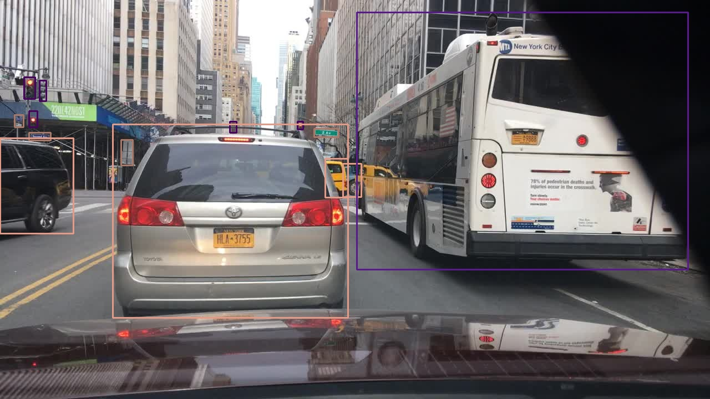
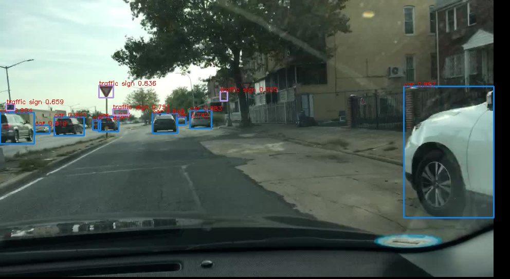

# 基于FCOS在BDD100k数据集上的检测任务

## 任务简介

使用BDD100数据集，采用FCOS训练一个道路交通检测模型，并完成部署

## 数据集

### BDD100K

|加州大学伯克利分校发布的 BDD100K 数据集，该数据集为迄今规模最大、最多样的自动驾驶数据集之一。

* 训练集数量：70000

* 验证集数量：20000

* 测试集数量：10000

* 数据结构

  ```markdown
  BDD100K
  ├── images
  │   └── 100k
  │       ├── test
  │       │   ├── <image_name.jpg>
  │       │   └── ...
  │       ├── train
  │       │   ├── <image_name.jpg>
  │       │   └── ...
  │       └── val
  │           ├── <image_name.jpg>
  │           └── ...
  └── labels
      ├── det_20
      │   ├── det_val.json
      │   └── det_train.json
  ```

* 类别信息

  | id   | class_name    | train set nums |
  | ---- | ------------- | -------------- |
  | 1    | pedestrian    | 92159          |
  | 2    | rider         | 4560           |
  | 3    | other person  | 210            |
  | 4    | car           | 700703         |
  | 5    | bus           | 11977          |
  | 6    | truck         | 27892          |
  | 7    | train         | 128            |
  | 8    | trailer       | 71             |
  | 9    | other vehicle | 804            |
  | 10   | motorcycle    | 3023           |
  | 11   | bicycle       | 7124           |
  | 12   | traffic light | 187871         |
  | 13   | traffic sign  | 238270         |

* 图片信息：

  * 分辨率：1280*720
  * 宽高比：0.56

* 检测框可视化

  
  
  

## 评价指标

1. 实时性要达到要求，实时性指标：在车载GPU上Delay要低于5ms
2. 在交通方面的任务中，安全为高优先级，因此Recall必须高

## baseline

### 训练效果

~~~txt
ap for pedestrian is 0.5151097881190794
ap for rider is 0.3250282741532011
ap for other person is 0.0
ap for car is 0.7255932716286726
ap for bus is 0.43860310407316605
ap for truck is 0.4499733365859862
ap for train is 0.005555555555555555
ap for trailer is 0.0
ap for other vehicle is 0.018769860660151537
ap for motorcycle is 0.28814182959003076
ap for bicycle is 0.34815424770876635
ap for traffic light is 0.5079547777075739
ap for traffic sign is 0.4063261723865
mAP=====>0.335
~~~

分析：

1. 观察到ap值和样本数量存在着正相关，因此可能存在样本不均衡的问题
2. traffic sign 样本数量较多，但是ap较低，可能为小目标检测能力较弱
3. 

可视化效果：



## 涨点triks

| 由于训练BDD100K过于耗费时间，选取前10K图片进行实验，实验结果如下：

| 马赛克 | PB samper | GIOU | 多尺度缩放 | map             |
| ------ | --------- | ---- | ---------- | --------------- |
| No     | NO        | No   | NO         | 0.187           |
| Yes    | No        | NO   | Yes        | 0.169（-0.018） |
| NO     | NO        | NO   | Yes        | 0.198（+0.011） |
| NO     | NO        | Yes  | Yes        | 0.210（+0.012） |
| No     | Yes       | Yes  | Yes        | 0.217（+0.005） |

### 马赛克

在YOLOV4中明显涨点的马赛克数据增强在本次任务中马赛克会明显的掉点，可视化分析其可能原因：

1. 在道路场景中物体位置有着相应的规律，采用马赛克的方法虽然可以丰富场景，但是许多场景是现实中不可能出现的，比如天空上方突然出现一条马路的场景。

   

2. 在BDD100K中的黑夜场景中，有的车辆被裁剪一半后很难分辨出其是车辆，此种情况会干扰训练

### GIOUloss

GIou公式：

$$GIoU = IoU-\frac{|C-(A\cup B)|}{C}  $$

* Giou的取值范围为[-1,1],因此GIoUloss公式为

  $$GiouLoss = -log（(1+Giou)/2）$$

### PBsamper

在本次任务中数据明显具有不均衡的特点，采用渐进式均衡采样的方法略有涨点，当然与数据增强的方法配合才有效。

公式1  : $P_j=\frac{n_j^q}{\sum_{n=1}^{100}{n_i^q}}$

* $p_j^{IB}$: 当公式（1）的q 取1 时得到的策略：样本多，采样概率大

* $p_j^{CB}$:当公式（1）的q 取0 时得到的策略，$P_j$全相等，都是1/C

公式2： $$p^{PB}_j(t) = (1-\frac{t}{T})p_j^{IB}+\frac{t}{T}P^{CB}_j$$

**实现方法**:

1. 获取到每个样本的标签，在目标检测中每个样本有多个标签，选取数量最少的标签为该样本标签
2. 统计每个类标签的数量
3. 根据每个类标签数量计算每个类的$p_j^{PB}$ 
4. $\frac{p_j^{PB}}{all}$计算每个样本的采样概率，赋值给WeightedRandomSampler

## TODO

- [ ] GFocal

- [ ] Dynamic Assigner

